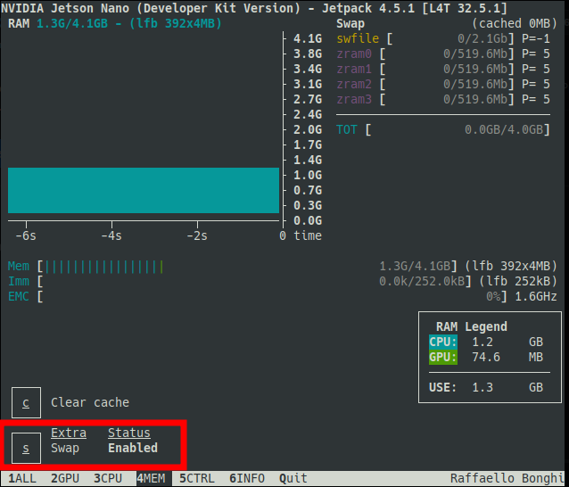

# Jetson-Stats

Tool used to manage and analyse the usage of the Jetson Nano resources

- How to Install
```
sudo apt install -y python3-pip
sudo -H pip3 install -U jetson-stats
```

- How to Use:
```
jtop
```

## Walkthrough

There are 6 menus on the bottom bar

- (1) General info… CPU, RAM, GPU, Energy Consumption, Temperature, Operation Mode, etc;
- (2) GPU statistics;
- (3) CPU statistics;
- (4) RAM/SWAP statistics
    - Here, we can increase SWAP size if necessary, as shown on the image below
    
    
- (5) Change and control Jetson FAN and operation modes;
- (6) Modules and system versions, compatibility, etc.

Source: https://github.com/rbonghi/jetson_stats
