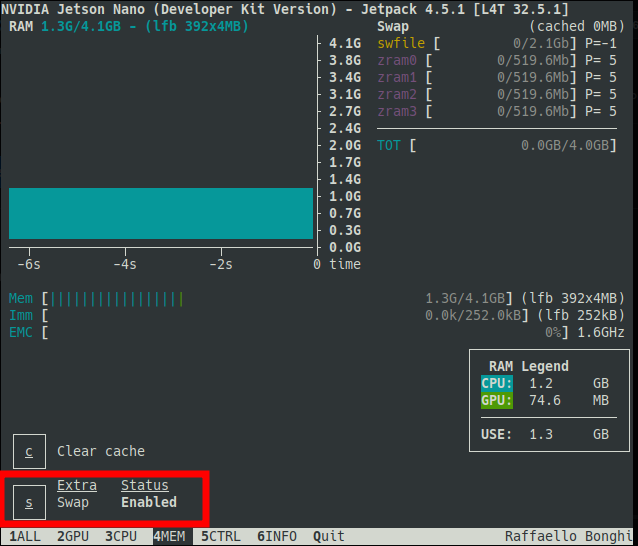

# Jetson-Stats

Ferramenta para gerenciar e analisar o uso de recursos da Jetson de maneira intuitiva e simples

- Para Instalar
```
sudo apt install -y python3-pip
sudo -H pip3 install -U jetson-stats
```

- Para usar:
```
jtop
```

## Walkthrough

Existem 6 menus inferiores

- (1) Informações Gerais… CPU, RAM, GPU, Energia, Temperatura, modo de operação, etc;
- (2) Estatisticas somente da GPU;
- (3) Estatisticas somenta da CPU;
- (4) Estatisticas do uso de memória RAM/Swap
    - Aqui é possível aumentar o tamanho do SWAP na parte inferior da tela, acrescentando 2GB, totalizando 4GB (destacado em vermelho)
    
    
- (5) Controle dos modos de operação da Jetson e FAN;
- (6) Informações dos módulos instalados e suas versões, dispositivos de rede, etc.

Fonte: https://github.com/rbonghi/jetson_stats
